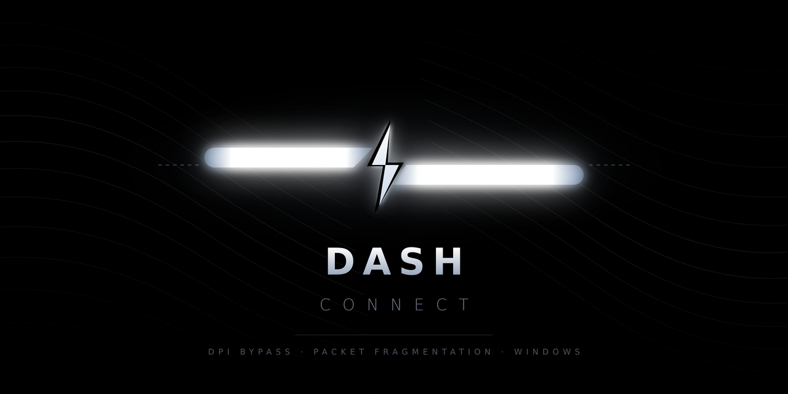

<p align="center">
  
</p>

# Dash Connect ⚡

**Однооконное Windows-приложение, снимающее блокировки РФ (Discord, YouTube, игры) через движок [Zapret](https://github.com/bol-van/zapret) — без VPN.**

Одна кнопка **Подключить** — и работают Discord, YouTube, игровые серверы (Fortnite / Apex / Dead by Daylight / FACEIT) и всё остальное, что блокируется на уровне DPI. Приложение запускается от администратора, само подбирает рабочую стратегию DPI-десинхронизации и живёт в системном трее.

---

## Возможности

- **Одна кнопка.** Один переключатель **Подключить / Отключить** поднимает всё.
- **Автоподбор стратегии.** Перед запуском проверяет Discord/YouTube и подбирает самый быстрый рабочий пресет (ранний выход — не перебирает все).
- **Игры без VPN.** Игровые серверы (порт 5222 + домены Epic/EA/Faceit/Behaviour) обходятся чистым `split` (без fake-пакетов, которые ломают игры). Сами игры идут напрямую — родной пинг.
- **Само находит заблокированное.** `--hostlist-auto`: winws сам определяет и обходит любой заблокированный домен (самообучение).
- **Telegram — кнопка «Починить Telegram».** Если провайдер режет Telegram так, что DPI не берёт, прога сама поднимает **Cloudflare WARP** (open-source `warp-plus`) или находит рабочий MTProto-прокси и настраивает Telegram в один клик. Без твоего сервера.
- **Шифрованный DNS (DoH).** При подключении система переключается на Cloudflare 1.1.1.1 с шифрованием (лечит DNS-подмену), при отключении возвращается **исходный** DNS. Защита от подмены на уровне провайдера.
- **Установщик MSI + авто-обновление.** Ставится как обычная программа; при старте проверяет GitHub Releases и предлагает обновиться в один клик.
- **Системный трей.** Сворачивание в трей, фоновая работа, без лишних консольных окон.

---

## Установка

1. Скачайте **`DashConnect-1.0.0.msi`** со страницы [Releases](https://github.com/dutow20162007-create/DashConnect/releases/latest).
2. Запустите — установщик поставит приложение и все ассеты Zapret в `Program Files\Dash Connect`, создаст ярлыки.
3. Запустите **Dash Connect от имени администратора** (нужно для WinDivert) → **Подключить**.

Обновления приходят автоматически: при запуске приложение проверяет наличие новой версии и предлагает установить.

---

## Требования

- Windows 10 / 11 (x64)
- **Права администратора** (через UAC-манифест)

Приложение **самодостаточно** — среда .NET и все ассеты Zapret (winws, WinDivert, списки, пресеты) уже внутри установщика. Ничего доустанавливать не нужно.

---

## Build & run

```powershell
# from the project root
.\build.ps1        # produces dist\DashConnect.exe (self-contained, single file)
.\run.ps1          # builds if needed, then launches elevated (UAC)
```

`build.ps1` auto-detects the user-local .NET 8 SDK at `%USERPROFILE%\.dotnet` or the one on `PATH`.

### Verify the engine (no admin, no network changes)

```powershell
& "$env:USERPROFILE\.dotnet\dotnet.exe" run --project src\DashConnect.SelfTest
```

`DashConnect.SelfTest` parses the real Zapret presets, exercises the proxy‑URL parser and the sing‑box config generator, and prints a PASS/FAIL report — safe to run from any shell.

---

## Как это работает

В РФ блокировка идёт двумя способами, и Dash Connect закрывает оба — **без VPN**.

### 1. DPI-десинхронизация (движок Zapret / winws)

Провайдер читает открытую часть TLS-соединения (имя сайта в ClientHello, SNI) и рвёт соединение (RST) или душит скорость. Zapret это обходит: `winws.exe` через драйвер **WinDivert** перехватывает исходящие пакеты и **десинхронизирует** их — фрагментирует ClientHello, подмешивает фейковые пакеты с «плохими» TTL/чек-суммами и т.п., так что DPI провайдера не может опознать соединение, а реальный сервер собирает его правильно.

Dash Connect не изобретает флаги — он **разбирает готовые пресеты Zapret** (`.bat`-файлы, раскрывая `%BIN%`/`%LISTS%`/`^!` как это делает cmd) и запускает `winws.exe` с проверенными наборами аргументов. Что настроено поверх:

- **Discord / YouTube** — штатные пресеты `FAKE TLS AUTO` с fake-TLS десинхронизацией.
- **Игры** (Fortnite / Apex / DBD / FACEIT) — игровые серверы используют **порт 5222** и чувствительны к fake-пакетам, поэтому для порта 5222 и доменов игровых сервисов (`lists/list-gameservers.txt`) используется **чистый `split`**. Сами игры идут напрямую — родной пинг.
- **Само находит остальное** — `--hostlist-auto`: winws следит за соединениями и сам добавляет в обход любой домен, который блокируется (порог: 3 сбоя за минуту).

**Автоподбор:** `StrategySelector` пробует пресеты по очереди, проверяя доступность Discord/YouTube, и останавливается на первом рабочем (ранний выход). `ZapretManager` держит процесс и подчищает `winws.exe` + службу WinDivert при остановке.

### 2. Шифрованный DNS (DoH) — против DNS-подмены

Второй механизм блокировки — провайдер отдаёт **фальшивый IP** на DNS-запрос. DPI тут бессилен. При подключении Dash Connect переключает систему на **Cloudflare 1.1.1.1 с DoH** (запросы шифруются — подменить нельзя), а при отключении **восстанавливает исходный DNS** (читая его из реестра, чтобы вернуть точь-в-точь). Есть защита от сбоя: если приложение упадёт с включённым DNS, при следующем запуске оно вернёт твой исходный.

### Предел

То, что блокируется **по IP целиком** (адрес вырезан из маршрутизации), обойти без прокси нельзя — пакет просто не доходит. Всё остальное (DPI + авто-детект + DoH) Dash Connect закрывает.

**Telegram-приложение через DPI надёжно не обходится** — оно ходит к дата-центрам по IP (MTProto), и десинхронизация на нём не срабатывает. Для этого есть кнопка **«Починить Telegram»** (Настройки): прога локально поднимает **Cloudflare WARP** (трафик Telegram идёт через сеть Cloudflare к дата-центрам, каскад scan → warp-in-warp → Psiphon), а если WARP заблокирован — находит рабочий **MTProto-прокси** из авто-обновляемых списков и настраивает Telegram. Один клик подтверждения в самом Telegram, без твоего сервера. WARP живёт, пока запущен Dash Connect.

---

## Благодарности / На чём основано

Dash Connect — это удобная GUI-обёртка и автоматизация поверх чужих открытых проектов. Вся заслуга по самому обходу DPI принадлежит их авторам:

- **[Zapret](https://github.com/bol-van/zapret)** от **[@bol-van](https://github.com/bol-van)** — оригинальный движок обхода DPI (`winws.exe` + драйвер WinDivert). Это ядро, которое реально делает десинхронизацию. Лицензия зависит от компонентов проекта (в основном свободные).
- **[zapret-discord-youtube](https://github.com/Flowseal/zapret-discord-youtube)** от **[@Flowseal](https://github.com/Flowseal)** — сборка Zapret с готовыми пресетами под Discord/YouTube (версия 1.9.9c). Именно её пресеты Dash Connect парсит и запускает; кастомные пресеты (`general (Dash Connect)`, блоки игр/авто-детекта) сделаны на их основе.
- **[WinDivert](https://github.com/basil00/WinDivert)** от **@basil00** — драйвер перехвата пакетов, который использует Zapret.
- **[sing-box](https://github.com/SagerNet/sing-box)** от **[SagerNet](https://github.com/SagerNet)** — опциональный TUN-туннель (для режима VPN, по умолчанию выключен).
- **[warp-plus](https://github.com/bepass-org/warp-plus)** от **[bepass-org](https://github.com/bepass-org)** — клиент Cloudflare WARP для кнопки «Починить Telegram» (WARP — сервис Cloudflare).
- MTProto-прокси списки: **[shablin/mtproto-proxy](https://github.com/shablin/mtproto-proxy)**, **[SoliSpirit/mtproto](https://github.com/SoliSpirit/mtproto)** — публичные авто-обновляемые списки для fallback Telegram.

**Что добавляет сам Dash Connect:** русский GUI в одну кнопку, автоподбор пресета, игровой `split` на порту 5222, авто-детект блокировок, авто-переключение на шифрованный DNS, системный трей, MSI-установщик и авто-обновление.

> Если ты автор одного из проектов выше и хочешь изменить формулировку или убрать упоминание — открой issue.

---

## Project layout

```
DashConnect.sln
src/
  DashConnect.Core/         # engine (net8.0) — no UI, no admin manifest, fully testable
    Zapret/            #   StrategyProvider (batch parser), ZapretManager, HostlistManager
    Diagnostics/       #   ConnectivityTester, StrategySelector
    Singbox/           #   SingboxDownloader, SingboxConfigBuilder, ProxyUrlParser, GameRoutes, SingboxManager
    Services/          #   AppOrchestrator (the Connect/Disconnect brain)
    Config/ Models/ Util/ Logging/
  DashConnect.App/          # WPF UI (net8.0-windows) — dark dashboard, custom toggles, tray
  DashConnect.SelfTest/     # headless verification harness (net8.0 console)
build.ps1  run.ps1
```

`DashConnect.Core` targets `net8.0` and carries no admin manifest, so its logic can be exercised head‑lessly. Only the WPF shell carries `requireAdministrator`.

---

## Data & logs

Everything the app writes lives in `%AppData%\DashConnect\`:

| File | Purpose |
|------|---------|
| `config.json` | user settings |
| `game-routes.json` | editable game routing signatures |
| `singbox\sing-box.exe` + `config.json` | downloaded binary + generated tunnel config |
| `logs\dashconnect.log` | rolling activity log |

Open it quickly from **Settings → App data ▸**.

---

## Troubleshooting

- **“Administrator required”** — the app must be elevated. Use `run.ps1` or right‑click → *Run as administrator*.
- **A strategy never makes Discord open** — enable **Deep scan** to trial every preset, or add the blocked domain under **Settings → Add blocked domain** (it appends to `list-general-user.txt`).
- **Game routing does nothing** — confirm the proxy URL is a valid `vless://`/`ss://` link and that sing‑box downloaded (watch the log). Check `%AppData%\DashConnect\singbox\config.json`.
- **`winws` won’t start** — a previous instance may hold WinDivert; Dash Connect reaps orphans automatically, but a reboot clears a wedged driver.

---

## Notes on intent

Dash Connect is a personal connectivity tool: it restores access to services that are throttled/geoblocked and keeps game traffic fast. It wraps two well‑known open‑source projects (Zapret, sing‑box) with a friendly GUI and automation. Use it in accordance with the terms of the services you connect to and your local law.
